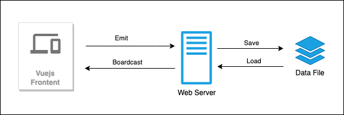
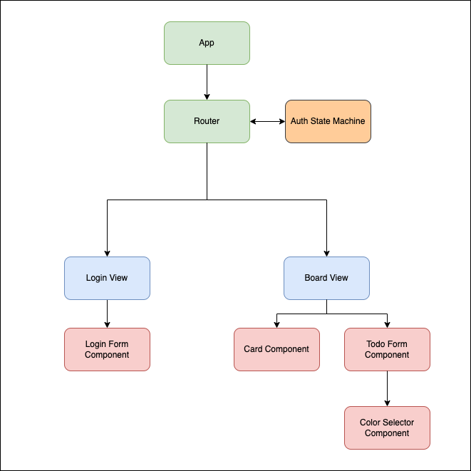

# Design Document: Todo.io

## Overview
Todo.io is todo application with multiplay twist.

## Solution

### Architecture
It's very simple web application architecture. Vue is used for build web interaces. Socket.io is used for emit/boardcast any data exchange between server and client. Todo data is stored server in-memory and write to file with JSON format either every 5 second or terminal signal is received. 

### Vue Views and Components

## Improvement
### Feature:
- Eiditable for a todo:  
Currently a todo cannot be modified once it created. Suggest to add editable function for a todo.

- History:  
Show log history of a todo, e.g. who and when edit a todo.

- "View more" for todo description:  
Only show first few lines of description and hide the remaining. Create a "View more" liked button to show all description.

- Support custom color selection:  
Create more slots for color selection and enable selection from the color palette.

- Drag and Drop:  
Enable drag and drop for each of todo item in board.

- n18i:  
Multilingual support

### Architecture: 
- Presistent Data storage:  
Replace file based data storage to database. Consider that it may be high write activity, NoSQL database such as mongoDB, cassandra will be suggested in this case.

- Authenication:  
Create a autenication service for user and suggest to integrate with social login.

## Shakeholders:
- Wilson Chow (development)

## Last Updated
23/01/2023 15:00